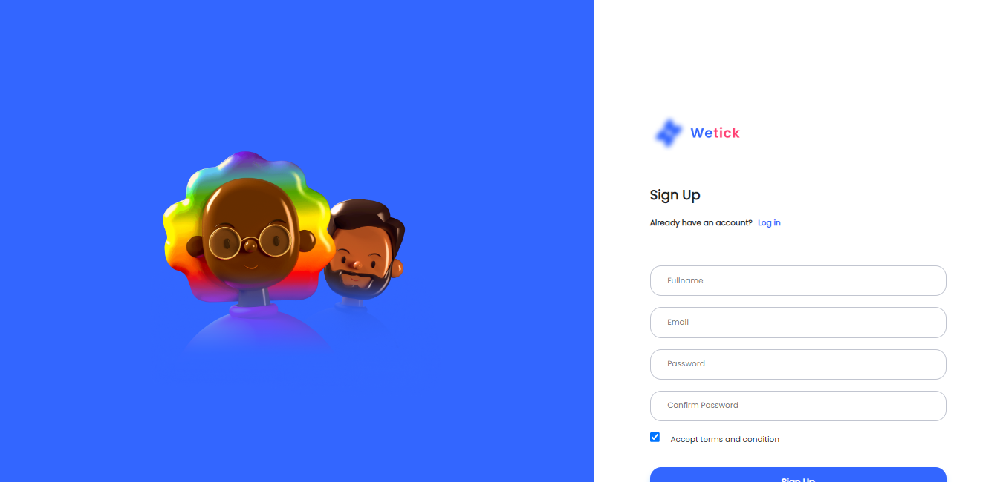
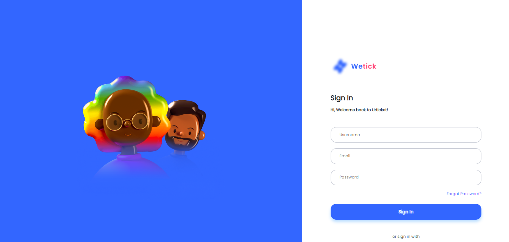
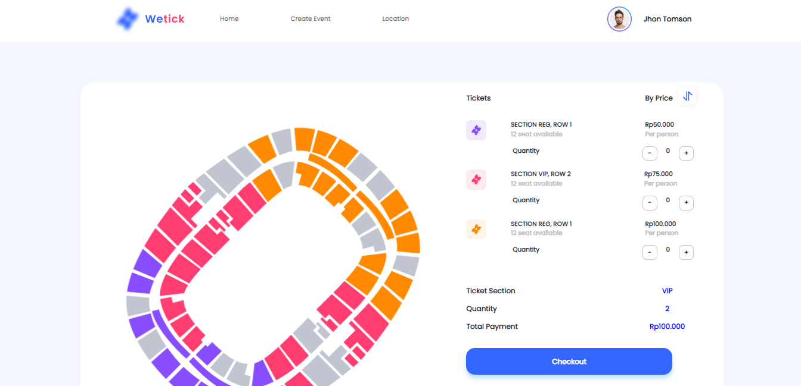
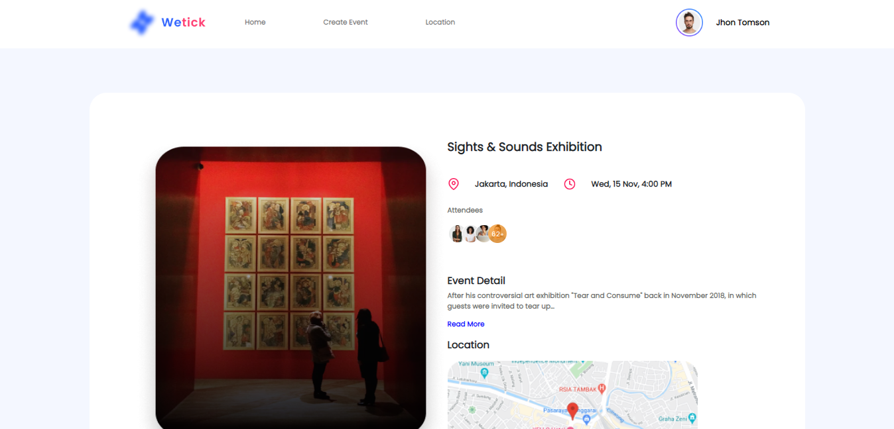
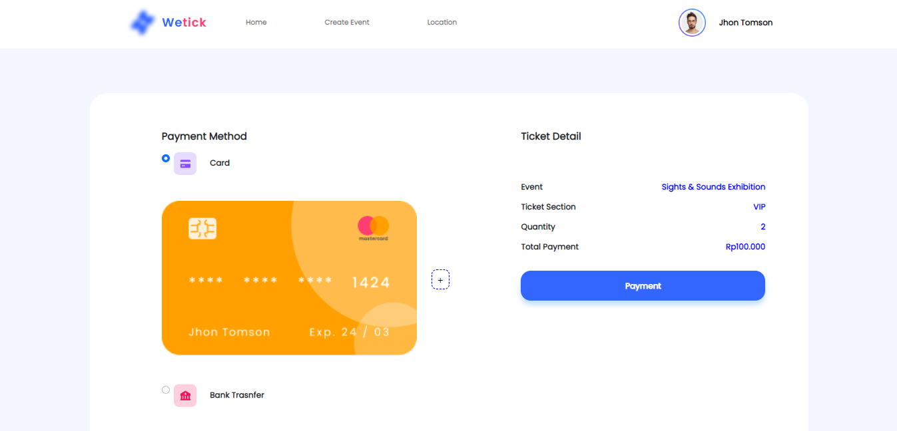

<h1 align='center'>Dream_Events Website </h1>
  

    <a href="link_deploy">https://dream-events-apps.netlify.app/</a>
    ·
    <a href="https://github.com/FazzWeb10/Responsive-Website/issues">Report Bug</a>
    ·
    <a href="https://github.com/FazzWeb10/Responsive-Website/pulls">Request Feature</a>
  

</img>
</img>
</img>
</img>
</img>

## About The Project

#background_projek.

## Built With

## Acknowledgements

- [Bootstrap](https://getbootstrap.com/)

## License

© [Irfan Alfiansyah](https://github.com/IrfanAlfiansyah/)